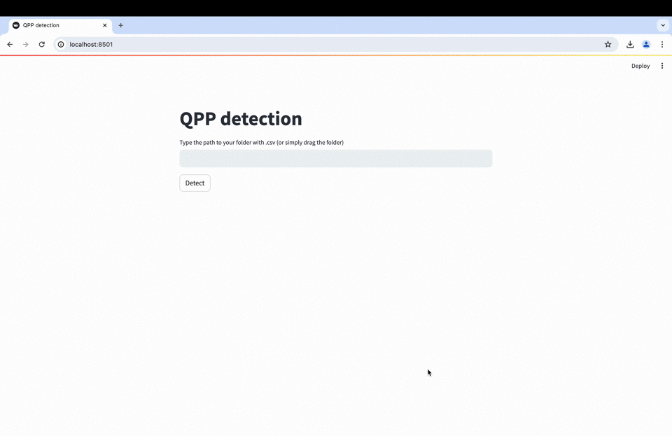

# QPP-Detection
Neural network approach to find QPP in light curves of solar and stellar flares.

## Project description

QPP-Detection is the project to detect Quasi Periodic Pulsations (QPP) in solar and stellar flares and a part of our [paper](). To detect QPPs, we used the Fully Convolutional Network (FCN) archtiecture proposed by [Wang et al. (2017)](https://ieeexplore.ieee.org/document/7966039/authors#authors).

The project consistst of two main parts:
- Notebooks to generatate synthetic dataset and train the FCN (**Notebooks** folder)
- [Streamlit](https://streamlit.io) browser application to use the FCN pretrained  on the [synthetic dataset](doi.org/10.7910/DVN/UNRTN6
) for the QPP detection task on custom data (**Application** folder)

## Table of Contents
- [Prerequisites](#prerequisites)
- [How to install and run the application](#how-to-install-and-run-the-application)
- [Usage](#usage)
- [Contributing](#contributing)
- [License](#license)

## Prerequisites
- Anaconda/Miniconda distribution installed

## How to install and run the application
 - Clone or copy this project repository
 -  Change your working directory to the root directory of the project: cd <QPP_Detection_folder>
 -  Create new Anaconda environment: _conda env create -f ./Environment/env.yml_
 -  Activate the environment created: _conda activate qpp_detection_
 -  Run the application: _streamlit run ./Application/app.py_
 -  If the steps above are successful you can open the application in your browser by the url _http://localhost:8501_ (it may differ) if it's not opened automatically

## Usage
**To run the application:**
 -  Change your working directory to the root directory of the project: cd <QPP_Detection_folder>
 -  Activate the environment created: _conda activate qpp_detection_
 -  Run the application: _streamlit run ./Application/app.py_
   
**To use the application**:
 -  Open the application in your browser by the url _http://localhost:8501_ (it may differ) if it's not opened automatically
 -  Type the path of folder with QPP data. QPP must be in the .csv format. Each .csv file must contain the 'flux' column with light curve data
 -  Click "Detect" button
 -  After FCN made its predictions, click "Download data as CSV" to get them

## Contributing

## Acknowledgements
The work is supported by STFC Grant ST/X000915/1

## License
This project is licensed under the Apache 2.0. License - see the [LICENSE.md](./LICENSE) file for details

